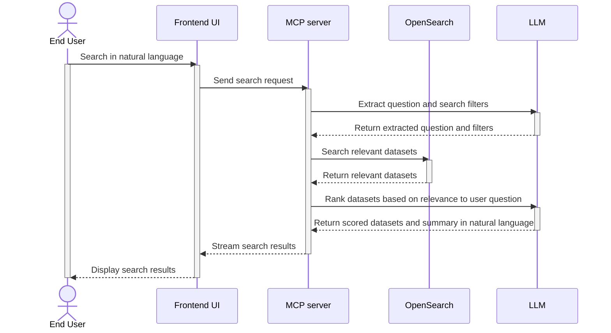

# Flow chart for WP04 - Data Discovery

```mermaid
sequenceDiagram
        actor User as End User
        participant UI as Frontend UI
        participant MCP as MCP server
        participant OpenSearch
        participant LLM
        User->>UI: Search in natural language
        activate User
        activate UI
        UI->>MCP: Send search request
        activate MCP
        MCP->>LLM: Extract question and search filters
        activate LLM
        LLM-->>MCP: Return extracted question and filters
        deactivate LLM
        MCP->>OpenSearch: Search relevant datasets
        activate OpenSearch
        OpenSearch-->>MCP: Return relevant datasets
        deactivate OpenSearch
        MCP->>LLM: Rank datasets based on relevance to user question
        activate LLM
        LLM-->>MCP: Return scored datasets and summary in natural language
        deactivate LLM
        MCP-->>UI: Stream search results
        deactivate MCP
        UI-->>User: Display search results
        deactivate UI
        deactivate User
```
